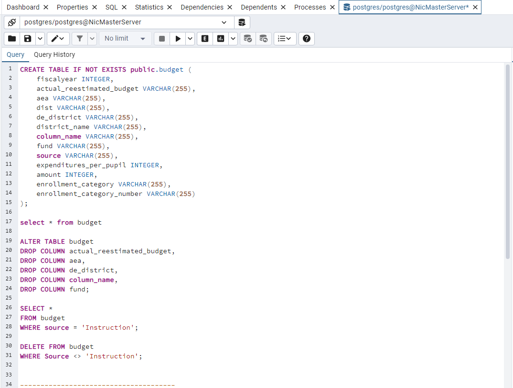
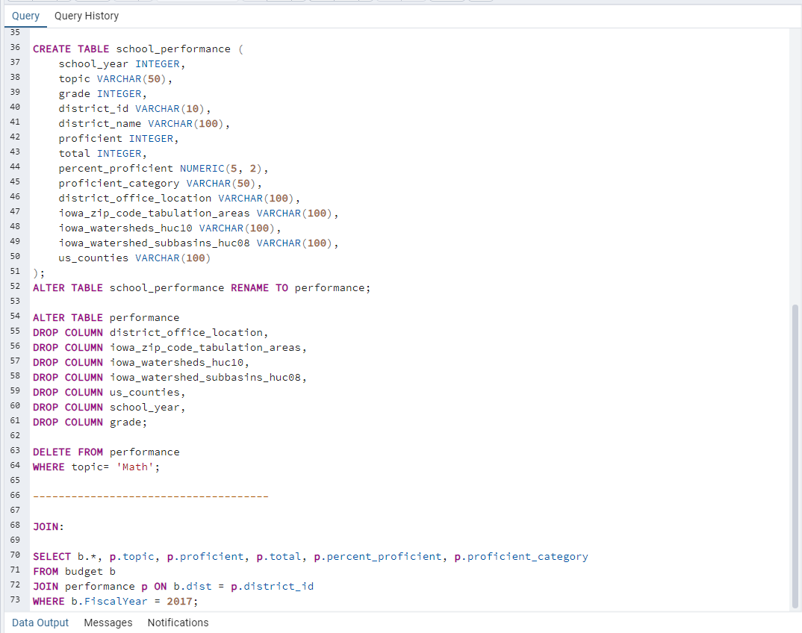

# msda-capstone
## Author: Nic Vetter

Hello and welcome to my GitHub repo for my Master's of Science in Data Analytics through Northwest Missouri State University. 
Throughout the capstone project, I will be using analyzing the trends of public high school spending and proficiency percentages using the following tools/skills:

SQL, Machine Learning in Python, Tableau, Overleaf, and LaTeX. 

My hope is to show the correlation between Iowa Public Schools $/pupil and Math/Reading proficiency scores on standardized tests. 

I will then forecast the minimum $/pupil schools should be spending to meet proficiency standards. 

I am happy you are reading through this project and have a great day!

## Data Sources:
[Data Source 1](https://data.iowa.gov/Primary-Secondary-Ed/Math-And-Reading-Proficiency-in-Iowa-by-School-Yea/f3h8-mnxi/about_data)

[Data Source 2](https://data.iowa.gov/School-Finance/Iowa-School-District-Expenditures-by-Fiscal-Year/uutu-bzs3/about_data)

This data set was collected from the Iowa.gov website as public information. The Iowa.gov website
has an ”Action Query” function that helps the writer filter the necessary data from the dataset. This
is called preliminary cleaning of the dataset and the dataset will be cleaned again in section 3 of this
report. The writer will only be using the reading proficiency rating of the 2017 11th-grade students in
each respective district. This is to shorten the report for the tight time window

## Data Cleaning/Manipulation using PostgreSQL and PgAdmin:

The below images show the cleaning SQL syntax within PgAdmin along with a JOIN function to create a singular CSV file.
This was joined because of the ease of reading/loading within Python/pandas. 

## Overview of Clean Data after PostgreSQL:

The attributes after the cleaning process was completed are as follows:
”fiscalyear”,”dist”,”district name”,”source”,”expenditures per pupil”,”amount”,”enrollment category”,”enrollment
category number”,”topic”,”proficient”,”total”,”percent proficient”,”proficient category”.

Below is a sample of the CSV’s first line of the cleaned data:
2017,”0009”,”AGWSR”,”Instruction”,7989,4997256,”600-999”,”3”,”Reading”,32,41,”78.00”,”70.1 - 80”.

If the data shown in the line above is surrounded by ””, it is a string/text data type. However, if
the data shown in the line above is surrounded by nothing, it is an integer data type.

To align with the goal of the report, the dependent variable of the project is ”percent proficient” and
the independent variables are all of the other attributes contained within the cleaned CSV file(outlined
above). However, the main independent variable that will be analyzed is ”expenditures per pupil”.

### Virtual Environment Set-Up:

### Installation Instructions

Before setting up the virtual environment, ensure you have Python and pip installed:

- **Python**: You can download it from [python.org](https://www.python.org/downloads/).
- **pip**: Typically installed automatically with Python. You can check by running `pip --version` in your terminal.

### Setting Up the Virtual Environment

1. **Clone the Repo and Navigate to Your Project Directory in VSCode**:
   
2. Create the Virtual Environment:
   
   python3 -m venv myenv
   
3. Activate the Virtual Environment:
   
   myenv\Scripts\activate
   
4. Install dependencies, this project's dependencies can be found in the requirements file:

   pip install -r requirements.txt

   Also, please verify the installation of dependencies:
   
   pip list

   ## Overview of Exploratory Data Analysis in Python/Jupyter Notebooks:
Choosing the right tools to conduct EDA is very important for any analyst. For the analysis of the Iowa Public School proficiency and expenditures, Jupyter Notebooks was the best option. This is because of the amazing visualization capabilities of Jupyter within a virtual environment. The modules used were as follows: pandas, matplotlib.pyplot, and seaborn.

This report's EDA process is outlined with the following sections: Data Acquisition - Read and View Dataset, Data Inspection - Data Type / Numerical Stats / Missing Value Verification, Numerical Attribute Histograms, Categorical Attribute Bar Charts,  and Initial Visualizations. All of these sections provide insights into the data selected for this report/analysis. Also, there are some very interesting correlations, or lack of correlations, between certain attributes. 

### Data Acquisition - Read and View Dataset
The first step of EDA is to acquire the cleaned data. The data was read from the CSV file using the pandas module. Also, the head of the dataset was shown as a confirmation that the data was read into the notebook.

### Data Inspection - Type / Stats / Missing Values
The second step of EDA is to inspect the pandas dataset. The data was inspected for data type information, statistics for numerical columns, and finally, a missing value verification was conducted. However, no missing values were found, so no figures are shown in that notebook summary.

### Numerical Histograms
The third step of EDA is to conduct a data distribution of numerical attributes within the dataset. More specifically, the most interesting attributes were: "expenditure per pupil" and "percent proficient".

### Categorical Bar Charts
The fourth step of EDA is to conduct a data distribution of categorical attributes within the dataset. More specifically, the most interesting text attributes were: "proficient category" and "enrollment category".
   
### EDA Visualizations
The fifth and final step of EDA is to create some visualizations that accurately capture the data, and check if any correlations need to be investigated further. 
The first visualization was created to view the average percent proficient for each enrollment category number. 
The second visualization was created so the minimum and maximum reading proficiency could be shown to the viewer.
The final visualization was created to show any preliminary correlation between budget expenditure and reading proficiency.

### Conclusion of EDA
With the results of this EDA in mind, we will focus on the correlation between enrollment/expenditure attributes, and how they affect the dependent variable of "percent proficient".

-Nic Vetter
